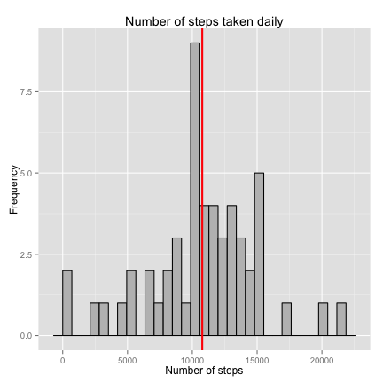
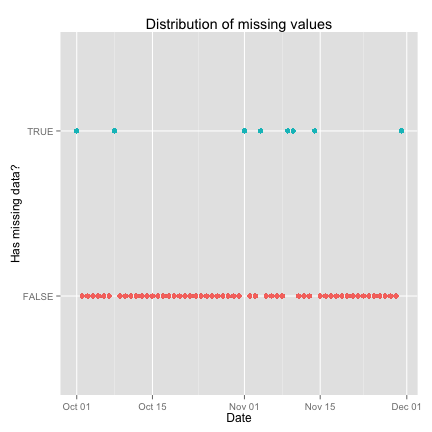
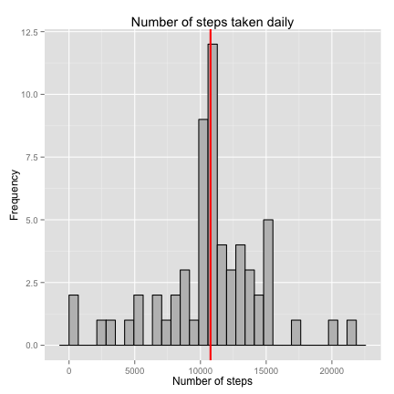
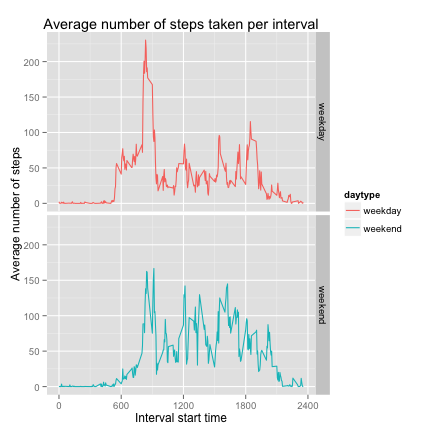

# Reproducible Research: Peer Assessment 1

```r
library(knitr)
library(ggplot2)
library(lattice)
library(scales) 
library(plyr)
options(digits=10)
```

## Setup `knitr` options.

```r
opts_chunk$set(message = FALSE, echo=TRUE,  results='hide',
               fig.width = 6, fig.height = 6)
```

## Loading and preprocessing the data

```r
# Load the data
activity <- read.csv(unzip('activity.zip'), stringsAsFactors=F)

# Transform the dates to Date format
activity <- transform(activity, date = as.Date(date))
stopifnot(class(activity$date)=="Date")
head(activity)

# Check that the number of unique intervals corresponds to a 
# full 24h of 5 minute intervals
nUniqueIntervals <- length(unique(activity$interval))
intervalDuration <- 5
stopifnot(intervalDuration == 24*60/nUniqueIntervals)
```

The activity dataset has 17568 entries with 
288 unique intervals.

## What is mean total number of steps taken per day?

```r
# The total number of steps per day
stepsPerDay <- ddply(activity, ~date, summarise, steps = sum(steps))

# The mean and median of the total number of steps per day
meanStepsPerDay <- mean(stepsPerDay$steps, na.rm=TRUE)
medianStepsPerDay <- median(stepsPerDay$steps, na.rm = TRUE)

# Histogram of the mean number of steps per day
ggplot(stepsPerDay, aes(x=steps))  +
  geom_histogram(colour="black", fill="grey") +
  geom_vline(aes(xintercept=meanStepsPerDay),
             color="red", linetype="solid", size=1) +
  xlab("Number of steps") + ylab("Frequency") +
  ggtitle("Number of steps taken daily")
```

 

Mean of the total number of steps per day: 10766.

Median number of steps per day: 10765.

## What is the average daily activity pattern?

```r
# Average number of steps per interval
meanStepsPerInterval <- ddply(activity,
                              ~interval, 
                              summarise,
                              meansteps = mean(steps, na.rm = T))

# Time series plot of the average number of steps per interval
ggplot(meanStepsPerInterval, aes(x=interval, y=meansteps))  +
  geom_line()   +
  scale_x_continuous(breaks=seq(0, 2400, 300)) +
  xlab("Interval start time") + ylab("Average number of steps") +
  ggtitle("Average number of steps taken per interval")
```

 

```r
# Which 5 minute interval contains the maximum number of steps
intervalNumberOfMaximumSteps <-  which.max(meanStepsPerInterval$meansteps)
intervalOfMaximumSteps <- meanStepsPerInterval[intervalNumberOfMaximumSteps,]
```

The maximum average number of steps is 
206
and is taken in interval number 104 at an interval 
start time of 835

## Imputing missing values

```r
# The total number of missing values in the dataset. Sum the 
# number of rows for which at least one of the values is NA
numMissingValues<-sum(apply(is.na(activity), 1, any))

# Plot the distribution of missing data
ggplot(activity, aes(x=date, y=is.na(activity$steps),
                     colour = is.na(activity$steps))) +
  geom_point() +
  scale_colour_discrete(guide = FALSE) +
  xlab("Date") + ylab("Has missing data?") +
  ggtitle("Distribution of missing values") 
```

 

The number of missing values is 2304

Pct of missing data: 13.1147540984.


```r
# Impute NA values using the rounded mean for each 5 minute interval
activityImputed<- ddply(activity, ~interval, function(d) {
  steps <- d$steps
  d$steps[is.na(steps)] <- round(mean(steps, na.rm = TRUE))
  return(d)
})

# The number of steps per day from imputed data
stepsPerDayImputed <-  
  ddply(activityImputed, ~date, summarise, steps = sum(steps))

# The mean and median of the total number of steps per day from imputed data
meanStepsPerDayImputed <- round(mean(stepsPerDayImputed$steps, na.rm=TRUE))
medianStepsPerDayImputed <- median(stepsPerDayImputed$steps, na.rm = TRUE)

# Histogram of the number of steps per day from imputed data
ggplot(stepsPerDayImputed, aes(x=steps))  +
  geom_histogram(colour="black", fill="grey") +
  geom_vline(aes(xintercept=meanStepsPerDayImputed),
             color="red", linetype="solid", size=1) +
  xlab("Number of steps") + ylab("Frequency") +
  ggtitle("Number of steps taken daily")
```

 

Mean of the total number of steps per day (imputed): 
10766.

Median number of steps per day (imputed): 
1.0762e+04.

Difference of mean of raw and imputed data: 
0.

Difference of median of raw and imputed data: 
3.


## Are there differences in activity patterns between weekdays and weekends?

```r
# Define the weekend days 
weekend<-c("Saturday", "Sunday")
isWeekend <- weekdays(activityImputed$date) %in% weekend

# Add day type factor variable to imputed activity data 
activityImputed<- transform(activityImputed ,daytype = 
                              ifelse(isWeekend ,"weekend","weekday"))
head(activityImputed) 

# Mean steps per 5 minute interval per day type
meanStepsPerDayType <- ddply(activityImputed,
                  .(interval, daytype),
                  summarise,
                  meansteps = mean(steps))

# Plot the average number of steps per interval for weekdays and weekends
ggplot(meanStepsPerDayType, aes(x=interval, y=meansteps, color=daytype)) +
  facet_grid(daytype ~ .) +
  geom_line()   + 
  scale_x_continuous(breaks=seq(0, 2400, 600)) +
  xlab("Interval start time") + ylab("Average number of steps") +
  ggtitle("Average number of steps taken per interval")
```

 
